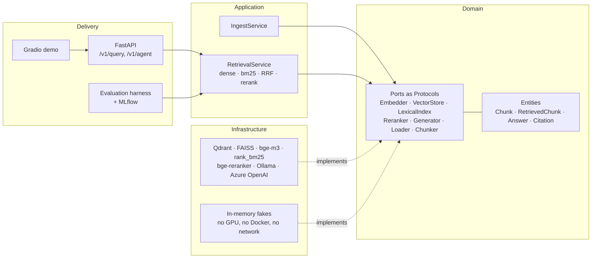

# DC-Ops RAG

**Grounded question answering over datacenter facilities documentation** — hybrid retrieval,
honest evaluation, and a small tool-calling agent, built in Clean Architecture and served
through FastAPI in Docker.

[](https://github.com/AbdullahTarakji/dc-ops-rag/actions/workflows/ci.yml)
[](https://www.python.org/downloads/release/python-3110/)
[](LICENSE)
[](https://github.com/astral-sh/ruff)
[](https://mypy-lang.org/)

> **Status: iteration 0 of 9 — architecture and test harness.**
> The pipeline runs end to end against in-memory fakes. Real adapters (PDF loaders, bge-m3,
> Qdrant, BM25, the cross-encoder, Ollama) arrive in the iterations listed in the
> [roadmap](#roadmap). Results tables will appear here when the evaluation harness has
> produced them — not before, and not as promises.

---

## What this is

Ask a question about datacenter cooling, power or efficiency standards, and get an answer
that is **grounded in the documentation, cited to the page, and willing to say "the
documentation does not cover this."**

Three things make it more than a demo:

1. **Abstention is a first-class outcome.** In facilities engineering a confident wrong
   answer costs money. "Not in the corpus" is a correct answer here, and it is measured.
2. **It is evaluated like a real ML system.** A gold set split into dev and test, all tuning
   on dev, the test set touched exactly once, bootstrap confidence intervals, and McNemar's
   test for system-vs-system comparisons. Ties are reported as ties.
3. **The retrieval strategy is an experiment, not an assumption.** Dense, BM25, hybrid with
   Reciprocal Rank Fusion, and hybrid plus cross-encoder reranking all run behind the same
   interface, so the ablation table decides which one ships.

## Architecture

Dependencies point inwards. The domain knows nothing; the application layer knows only
ports; adapters know everything and are interchangeable.



Why it is built this way: swapping Qdrant for Azure AI Search, or Ollama for Azure OpenAI,
is one new adapter and one line in the composition root — and every use case is testable
without a GPU. The full reasoning is in [docs/adr/](docs/adr/), and the teaching walkthrough
is in [docs/learn/01-ports-and-adapters.md](docs/learn/01-ports-and-adapters.md).

## Quickstart

Requires [uv](https://docs.astral.sh/uv/). Nothing else — the default install pulls no
machine-learning stack, and the test suite runs entirely on in-memory fakes.

```bash
git clone https://github.com/AbdullahTarakji/dc-ops-rag.git && cd dc-ops-rag && uv sync
```

```bash
uv run pytest
```

Optional dependency groups are installed per iteration, so you only download what you use:

```bash
uv sync --extra retrieval --extra ingest
```

## Repository layout

| Path | What lives there |
|---|---|
| `src/dcrag/domain/` | Entities and ports. Standard library only. |
| `src/dcrag/application/` | Use cases: ingestion, retrieval, fusion. No technology choices. |
| `src/dcrag/infrastructure/` | Adapters, including the in-memory fakes used by CI. |
| `src/dcrag/api/` · `agent/` · `eval/` | Delivery, agent, and the evaluation harness. |
| `docs/learn/` | One lesson per iteration — the teaching track. |
| `docs/adr/` | Architecture decision records: what was chosen, and what was rejected. |
| `docs/certifications/` | How the code maps to AI-901 / AI-103 / AI-300 objectives, gaps included. |
| `configs/` · `prompts/` | Versioned experiment configs and prompts. |
| `data/gold/` | The evaluation gold set. Corpus PDFs are never committed. |

## Roadmap

| # | Iteration | State |
|---|---|---|
| 0 | Architecture, ports, fakes, CI | **done** |
| 1 | Corpus download and PDF ingestion (PyMuPDF vs Docling) | next |
| 2 | Embeddings, Qdrant/FAISS, BM25, RRF, cross-encoder reranking | |
| 3 | Grounded generation, citation validation, prompt-injection defence | |
| 4 | Gold set, metrics, MLflow, ablations, McNemar, sealed test run | |
| 5 | FastAPI, Docker Compose, API tests on fakes | |
| 6 | LangGraph agent with document search, PUE calculator, chiller fault check | |
| 7 | Tracing, token and cost accounting, Gradio demo | |
| 8 | Azure OpenAI + Azure AI Search parity run | |
| 9 | Certification traceability pack and portfolio polish | |

## Corpus and licensing

The corpus is public datacenter facilities documentation — the EU Code of Conduct on Data
Centre Energy Efficiency best-practice guidelines (JRC), LBNL/DOE guides, and freely
published vendor white papers. **No PDFs are committed to this repository.**
`scripts/download_corpus.py` fetches them, and every source's licence and retrieval date is
recorded in `docs/corpus.md`. Copyrighted material that cannot be redistributed — the ASHRAE
Datacom book series, for instance — is deliberately excluded.

## License

MIT for the code (see [LICENSE](LICENSE)). Corpus documents keep their own licences.
